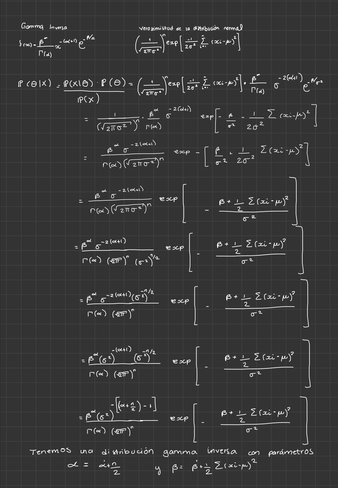

Un reporte con las respuestas se deberá enviar por correo electrónico a más 
tardar el lunes 7 a las 15:00 horas.

Instrucciones: 

- En las siguientes preguntas describe tus procedimientos y escribe las
respuestas explícitamente (que no haya necesidad de correr código para 
obtenerlas). 

- Incluye el código.

- No está permitido discutir el exámen fuera de su equipo.

- Para dudas (que no deben incluir info. de la respuesta) se preguntará en el 
canal de slack #examen-final.

## 1. Pruebas de hipótesis

De acuerdo a una encuesta en EUA, 26% de los residentes adultos de Illinois han 
terminado la preparatoria. Un investigador sospecha que este porcentaje es
menor en un condado particular del estado. Obtiene una muestra aleatoria de 
dicho condado y encuentra que 69 de 310 personas en la muestra han completado
la preparatoria. Estos resultados soportan su hipótesis? (describe tu elección de
prueba de hipótesis, valor p y conclusión).
 
------------------------------------------------------ 
**SOL**

Lo que deseamos probar es si la media obtenida por medio de una muestra de pobladores con preparatoria concluída de un condado $x$
es consistente con la media de la población con preparatoria terminada del estado de Illinois.  

Es decir,

$$H_0: \theta = \theta_0 \textbf{ vs. } H_1:  \theta \not= \theta_0$$
Donde la media de Illinois es $0.26$ y la media obtenida por la muestra del condado es $0.22$.

En este caso, utilizamos la estimación usual del error estándar de que está dada por: 

$$\hat{\textsf{ee}} = \sqrt{\frac{0.22(1-0.22)}{310}} = \sqrt{\frac{ 0.1716}{310}} = \sqrt{0.0005535484}= 0.02352761$$ 
Entonces nuestro estadístico de Wald es de la siguiente forma: 

$$W = \frac{0.22 - 0.26}{ 0.02352761}=  -1.70013$$
Ahora, si calculamos el p-value tenemos lo siguiente: 

```{r}
valor_p <- 2 * (1 - pnorm(abs(-1.70013)))
valor_p
```

Y vemos que en este caso tenemos evidencia baja de que la proporción poblacional del condado con preparatoria terminada es distinta de $0.26$.

Por lo tanto no rechazamos $H_0$.


## 2. Relación entre bootstrap e inferencia bayesiana

Consideremos el caso en que tenemos una única observación $x$ proveniente de 
una distribución normal

$$x \sim N(\theta, 1)$$

Supongamos ahora que elegimos una distribución inicial Normal.

$$\theta \sim N(0, \tau)$$ 

dando lugar a la distribución posterior (como vimos en la tarea)

$$\theta|x \sim N\bigg(\frac{x}{1 + 1/\tau}, \frac{1}{1+1/\tau}\bigg)$$ 

Ahora, entre mayor $\tau$, más se concentra la posterior en el estimador de
máxima verosimilitud $\hat{\theta}=x$. En el límite, cuando $\tau \to \infty$
obtenemos una inicial no-informativa (constante) y la distribución posterior

$$\theta|x \sim N(x,1)$$

Esta posterior coincide con la distribución de bootstrap paramétrico en que generamos valores $x^*$ de $N(x,1)$, donde $x$ es el estimador de máxima
verosimilitud.

Lo anterior se cumple debido a que utilizamos un ejemplo Normal pero también 
se cumple aproximadamente en otros casos, lo que conlleva a una correspondencia
entre el bootstrap paramétrico y la inferencia bayesiana. En este caso, la
distribución bootstrap representa (aproximadamente) una distribución posterior 
no-informartiva del parámetro de interés. Mediante la perturbación en los datos
el bootstrap aproxima el efecto bayesiano de perturbar los parámetros con la
ventaja de ser más simple de implementar (en muchos casos).  
*Los detalles se pueden leer en _The Elements of Statistical Learning_ de 
Hastie y Tibshirani.

Comparemos los métodos en otro problema con el fin de apreciar la similitud en 
los procedimientos: 

Supongamos $x_1,...,x_n \sim N(0, \sigma^2)$, es decir, los datos provienen de 
una distribución con media cero y varianza desconocida.

En los puntos 2.1 y 2.2 buscamos hacer inferencia del parámetro $\sigma^2$.

2.1 Bootstrap paramétrico.

* Escribe la función de log-verosimilitud y calcula el estimador de máxima 
verosimilitud para $\sigma^2$.  Supongamos que observamos los datos 
`x` (en la carpeta datos), ¿Cuál es tu estimación de la varianza?


Sabemos que la densidad de una normal es:

$$f(x;\mu,\sigma)=\frac{1}{\sqrt{2\pi}\sigma}e^{\frac{(x-\mu)^2}{2\sigma`2}}$$

Por lo que la fución de verosimilitud es:

$$\mathcal{L}(x_1,...,x_n;\mu,\sigma)=\prod_{i=1}^{n}f_{x_i}(x_i;\mu,\sigma)=\prod_{i=1}^{n}f(x_i;\mu,\sigma)=\prod_{i=1}^{n}\frac{1}{\sqrt{2\pi}\sigma}exp\left\{-\frac{(x_i-\mu)^2}{2\sigma^2}\right\}$$

$$=\left(\frac{1}{\sqrt{2\pi}\sigma}\right)^nexp\left\{-\frac{1}{2\sigma^2}\sum_{i=1}^{n}(x_i-\mu)^2\right\}$$

Podemos trabjar con la logverosimilitud para facilitar los calculos

$$\ell(\sigma)=ln\mathcal{L}(\sigma)=-nln(\sqrt{2\pi}\sigma)-\frac{1}{2\sigma^2}\sum_{i=1}^{n}(x_i-\mu)^2$$
Ahora que tenemos la logverosimilitud, vamos a derivar e igualar a cero para maximizarla.

$$\frac{\partial}{\partial\mu}\ell(\sigma)=-\frac{n}{\sigma}+\frac{1}{\sigma^3}\sum_{i=1}^{n}(x_i-\mu)^2=0$$

$\leftrightarrow$

$$\frac{n}{\sigma}=\frac{1}{\sigma^3}\sum_{i=1}^{n}(x_i-\mu)^2$$

$\leftrightarrow$

$$n=\frac{\sigma}{\sigma^3}\sum_{i=1}^{n}(x_i-\mu)^2$$
$\leftrightarrow$

$$n=\frac{1}{\sigma^2}\sum_{i=1}^{n}(x_i-\mu)^2$$

$\leftrightarrow$

$$\sigma^2=\frac{1}{n}\sum_{i=1}^{n}(x_i-\mu)^2$$
 
 Por lo que:
 
$$\hat{\sigma^2}=\frac{1}{n}\Sigma(x_i-\mu)^2$$

Ahora con los datos de x tenemos la estimación:


```{r,echo=FALSE}
x<-read.csv("data/x.csv")
```


```{r}
S_2 <- sum((x$x-mean(x$x))^2)/length(x$x)
S_2
```


* Aproxima el error estándar de la estimación usando __bootstrap paramétrico__ y 
realiza un histograma de las replicaciones bootstrap.

```{r,echo=FALSE,warning=FALSE,message=FALSE}
library(tidyverse)
```


```{r}
rep_boot <- function(n){
  muestra_bootstrap <- rnorm(n,0,sqrt(131))
  tibble(parametro ="sigma", estimador_boot = sum((muestra_bootstrap-mean(muestra_bootstrap))^2)/length(muestra_bootstrap)) 
}
reps_boot <- map_dfr(1:5000, ~ rep_boot(150))
error<-sd(reps_boot$estimador_boot)
error
```


```{r,message=FALSE,warning=FALSE}
ggplot(data = reps_boot, aes(x=estimador_boot)) +
  geom_histogram() +
  geom_vline(xintercept = S_2, color = "red")+
  ggtitle("Replicaciones bootstrap")
```


2.2 Análisis bayesiano

* Continuamos con el problema de hacer inferencia de $\sigma^2$. Comienza 
especificando una inicial Gamma Inversa, justifica tu elección de los parámetros 
de la distribución inicial y grafica la función de densidad.


```{r,echo=FALSE,message=FALSE,warning=FALSE}
library(actuar)
```


Para la selección de parámetros inciales usaremos valores pequeños, pues no contamos con mucha información previa y no queremos agregar información extra con la que no contamos en este punto. Por lo que utiliaremos los siguientes parámetros iniciales:

```{r}
alpha_inicial<-0.1
beta_inicial<-0.1
```


```{r}
sims_gammainv_inicial <- tibble(
  theta = rinvgamma(20000, shape = alpha_inicial, scale = beta_inicial),
  dist = "inicial")
```


```{r,warning=FALSE,message=FALSE}
ggplot(sims_gammainv_inicial) +
  geom_histogram(aes(x = theta, fill = dist),
                 bins = 70, alpha = 0.5, position = "identity",
                 boundary = max(x$x))  +
  xlim(0, 500) + scale_y_sqrt() + ylim(0, 650)+
  geom_rug(data = x, aes(x = x))+
  ggtitle("Distribución inicial gamma inversa")
```


* Calcula analíticamente la distribución posterior.

Tenemos una distribución inicial Gamma Inversa: $f(x) = \frac{\beta^\alpha}{\Gamma(\alpha)}x^{- (\alpha + 1)} e^{-\frac{\beta}{x}}$

Y una verosimulitud: $\left(\frac{1}{\sqrt{2\pi\sigma^2}}\right)^n exp\left[\frac{-1}{2\sigma^2} \sum(x_i - \mu)^2\right]$


Por lo que nuestra distribución posterior $\mathbb{P}(\theta|X) = \mathbb{P}(X|\theta) \mathbb{P}(\theta)$

Es la siguiente: 

$$\left(\frac{1}{\sqrt{2\pi\sigma^2}}\right)^n exp\left[\frac{-1}{2\sigma^2} \sum(x_i - \mu)^2\right] * \frac{\beta^\alpha}{\Gamma(\alpha)}x^{- (\alpha + 1)} e^{-\frac{\beta}{x}} $$

$$ =\frac{\beta^\alpha\sigma^{2 ^{- (\alpha + 1)}}}{\Gamma(\alpha)(\sqrt{2\pi\sigma^2})^n} exp\left[\frac{-1}{2\sigma^2} \sum(x_i - \mu)^2 -\frac{\beta}{\sigma^2}\right]  $$

$$ =\frac{\beta^\alpha\sigma^{2 ^{- (\alpha + 1)}}}{\Gamma(\alpha)(\sqrt{2\pi})^n (\sigma^2)^{n/2}} exp\left[-\frac{\beta}{\sigma^2} - \frac{1}{2\sigma^2} \sum(x_i - \mu)^2 \right]  $$

$$ =\frac{\beta^\alpha\sigma^{2 ^{- (\alpha + 1)}}(\sigma^2)^{-n/2}}{\Gamma(\alpha)(\sqrt{2\pi})^n } exp\left[-\frac{\beta + \frac{1}{2}\sum(x_i - \mu)^2}{\sigma^2} \right]  $$

$$ =\frac{\beta^\alpha\sigma^{2 ^{- (\alpha + 1)}}(\sigma^2)^{-n/2}}{\Gamma(\alpha)(\sqrt{2\pi})^n } exp\left[-\frac{\beta + \frac{1}{2}\sum(x_i - \mu)^2}{\sigma^2} \right]  $$

$$ =\frac{\beta^\alpha\sigma^{2 ^{- \left[ (\alpha+ \frac{n}{2}) - 1\right]}}}{\Gamma(\alpha)(\sqrt{2\pi})^n } exp\left[-\frac{\beta + \frac{1}{2}\sum(x_i - \mu)^2}{\sigma^2} \right]  $$

Por lo tanto tenemos una distribución posterior Gamma Inversa con parámetros $\alpha = \alpha' + \frac{n}{2}$ y $\beta = \beta' + \frac{1}{2}\sum(x_i - \mu)^2$

Sustituyendo estos valores por los que tenemos en este problema, nuestros nuevos parámetros son de la forma: 


$\alpha = \alpha + 75 , \quad \beta = \beta +  9846.821$

### Desarollo a mano:

```{r echo=FALSE,fig.align='center', fig.height=3}

```

* Realiza un histograma de simulaciones de la distribución posterior y calcula
el error estándar de la distribución.

```{r, message=FALSE, warning=FALSE}

a =  75 + alpha_inicial

b =  9846.821 + beta_inicial


sims_gammainv_posterior <- tibble(
  theta = rinvgamma(20000, shape = a, scale = b),
  dist = "posterior")

```


```{r, message=FALSE, error=FALSE, warning=FALSE}
ggplot(sims_gammainv_posterior) +
  geom_histogram(aes(x = theta, fill = dist),
                 bins = 70, alpha = 0.5, position = "identity",
                 boundary = max(x$x))  +  
    scale_y_sqrt() +
  ggtitle("Distribución posterior gamma inversa")
```

* ¿Cómo se comparan tus resultados con los de bootstrap paramétrico?


Observamos que  el histograma de las replicaciones bootstrap  está casi completamnete contenido en el histograma de la distribución posterior Gamma Inversa, por lo que podemos decir que la varianza se encuentra en el rango de $100$ y $200$ 


2.3 Supongamos que ahora buscamos hacer inferencia del parámetro  $\tau=log(\sigma)$, ¿cuál es el estimador de máxima verosimilitud?


Como en el ejercicio pasado obtuvimos el estimados de máxima verosimilitud para la $\sigma$, el cual es: $\hat{\sigma^2}=\frac{1}{n}\Sigma(x_i-\mu)^2$, lo que podemos hacer es aplicarle logaritmo a esta ecuación y obtenemos el EMV para el parámetro $\tau$


$$log(\hat{\sigma^2})=log(\frac{1}{n}\Sigma(x_i-\mu)^2)$$

$$2 log(\hat{\sigma})=log(\frac{1}{n}) + log(\sum(x_i-\mu)^2)$$


$$2 log(\hat{\sigma})=log(\sum(x_i-\mu)^2) + (log(1) - log(n ))$$

$$2 log(\hat{\sigma})=log(\sum(x_i-\mu)^2) + (0 - log(n ))$$

$$ log(\hat{\sigma})= \frac{1}{2}\left(-log(n) + log(\sum(x_i-\mu)^2)\right)$$
Por lo tanto el estimador de máxima verosimilitud de $\tau$ es:
$\frac{1}{2}\left( log(\sum(x_i-\mu)^2) -log(n) \right)$

```{r}
tau <- (1/2)*(-log(150) + log(sum((x$x - mean(x$x))^2)))
tau
```


* Utiliza bootstrap paramétrico para generar un intervalo de confianza del 95% para el parámetro $\tau$ y realiza un histograma de las replicaciones  bootstrap.

Utilizamos las misma función `reps_boot` pero con nuestro nuevo parámetro $\tau$

```{r}
rep_boot <- function(n){
  muestra_bootstrap <- rnorm(n,0,sqrt(131))
  tibble(parametro ="sigma", estimador_boot = (1/2)*(-log(150) + log(sum((muestra_bootstrap - mean(muestra_bootstrap))^2)))) 
}
reps_boot <- map_dfr(1:5000, ~ rep_boot(150))
error<-sd(reps_boot$estimador_boot)
error
```


```{r,message=FALSE,warning=FALSE}
ggplot(data = reps_boot, aes(x=estimador_boot)) +
  geom_histogram()+
  ggtitle('Replicaciones bootstrap')+ 
  geom_vline(xintercept = tau, color = "red")
```


Intervalo de confianza: 

```{r}
quantile(reps_boot$estimador_boot, c(0.025, 0.975)) %>% round(2)
```

* Ahora volvamos a inferencia bayesiana, calcula  un intervalo de confianza para $\tau$ y un histograma de la distribución posterior de $\tau$

Distribución posterior.

Para obtener la distribución posterior de este caso lo que haremos será usar la posterior obtenida en el ejercicio anterior, aplicaremos raíz cuadrada y posteriormente logaritmo: 

```{r, message=FALSE, warning=FALSE}
sims_gammainv_posterior$tau <- log(sqrt(sims_gammainv_posterior$theta))
```

```{r, message=FALSE, error=FALSE, warning=FALSE}
ggplot(sims_gammainv_posterior) +
  geom_histogram(aes(x = tau, fill = dist),
                 bins = 70, alpha = 0.5, position = "identity",
                 boundary = max(x$x))  +  xlim(2.1,2.8)+
    scale_y_sqrt() +
  ggtitle("Distribución posterior gamma inversa")
```

Intervalo de confianza: 

```{r}
quantile(sims_gammainv_posterior$tau, c(0.025, 0.975)) %>% round(2)
```

Notamos que ambos histogramas son similares, más aún, el rango del intervalo de confianza para las replicaciones bootstrap es $0.23$, mismo rango para el intervalo de confianza para la distribución posterior.

### 3. Bayesiana y regularización

Lee el ejempo *2.7 Informative prior distribution for cancer rates* del libro
[Bayesian Data Analysis](http://www.stat.columbia.edu/~gelman/book/BDA3.pdf) (página 46).

En el siguiente ejercicio harás algo similar al ejemplo anterior, en este caso 
con el modelo Beta-Binomial.

Los datos *pew_research_center_june_elect_wknd_data.dta* tienen información de 
ecnuestas realizadas durante la campaña presidencial 2008 de EUA.


```{r}
poll_data <- foreign::read.dta("data/pew_research_center_june_elect_wknd_data.dta")
```

* Estima el porcentaje de la población de cada estado (excluyendo Alaska, Hawai, 
y DC)  que se considera *very liberal*, utilizando el estimador de máxima 
verosimilitud.

Sabemos que el estimador de maxima verosimilitud de una distribución Binomial es $\hat  p=\frac{x}{n}$

```{r,warning=FALSE,message=FALSE}
estimador <- poll_data %>% group_by(state) %>% 
            summarise(total = n(),
                      liberales = sum(ideo == "very liberal", na.rm = T),
                      estimador_mv = liberales / total) %>% 
            filter(! state %in% c("hawaii", "alaska","washington dc")) 
estimador
```


- Grafica en el eje *x* el número de encuestas para cada estado y en el eje *y* la estimación de máxima verosimilitud. ¿Qué observas?  
  
```{r}
ggplot(estimador,aes(x=total,y=estimador_mv)) +
  geom_point(colour= 'blue')+ggtitle("Número de encuentas por estado con estimador maximo verosimil")
  
```


Observamos que la variabilidad es alta, estados con poca cantidad de encuestas tienen un porcentaje de liberales desde casi cero hasta 10%, mientras que para estados con mayor número de encuestas observamos menos variabilidad.
  
  
- Grafica en el eje *x* el porcentaje de votos que obtuvo Obama en la elección para cada estado y en el eje *y* la estimación de máxima verosimilitud. ¿Qué observas? (usa los datos *2008ElectionResult.csv*)
  
  
```{r,message=FALSE,warning=FALSE}
elections_2008<-read_csv("data/2008ElectionResult.csv") %>% filter(! state %in% c("Hawaii", "Alaska","Washington")) %>% mutate(state = tolower(state))

compare_data <- estimador %>% inner_join(elections_2008, by = "state")

ggplot(compare_data,aes(x=vote_Obama_pct,y=estimador_mv)) +
  geom_point(colour= 'blue')+ggtitle("Porcentaje de votos por Obama por estado con estimador maximo verosimil")
```


Observamos que no hay tanta relación entre el porcentaje de votos por Obama y el porcentaje de votantes muy liberales.
  

* Estima el mismo porcentaje usando inferencia bayesiana, en particular la familia conjugada binomial-beta. Deberás estimar la proporción de manera 
independiente para cada estado, sin embargo, utilizarás la misma inicial a lo largo de todos.

- Para elegir los parámetros $\alpha$, $\beta$ de la incial considera la media y varianza de la distribución predictiva posterior (que en este caso tiene
ditsribución [Beta-Binomial](https://en.wikipedia.org/wiki/Beta-binomial_distribution)) y empata la media y varianza observadas a sus valores observados para después depejar $\alpha$ y $\beta$ (puedes usar [Wolfram alpha](https://www.wolframalpha.com/) para resolver).  
  
  
```{r}
A=mean(estimador$liberales/estimador$total)
B=var(estimador$liberales/estimador$total)
```

Resolviendo el sistema de ecuaciones $Media=\frac{\alpha}{\alpha + \beta}$ y $Var=\frac{\alpha\beta}{(\alpha+\beta)^2(\alpha + \beta + 1)}$ tenemos nuestros siguientes parámetros iniciales:

```{r}
a_inicial = 6.15744
b_inical = 127.99
```

```{r}
sims_beta_inicial <- tibble(
  p = rbeta(20000,a_inicial,b_inical),
  dist = "inicial")
```

```{r}
ggplot(sims_beta_inicial) +
  geom_histogram(aes(x = p, fill = dist),
                 bins = 70, alpha = 0.5, position = "identity")  +
    scale_y_sqrt() +
  ggtitle("Distribución inicial beta")
```

Ahora veamos la distribución posterior:

Por lo visto en clase, sabemos que la distribución posterior posterior de una Beta es: $Beta (k+\alpha,n−k+\beta)$


```{r}
simular_posterior <-function(n, k, a=a_inicial, b=b_inical){
  mean(rbeta(20000,k+a,n-k+b))
}
```


```{r}
estimador$bayesian=-99
for (i in 1:nrow(estimador)){
  estimador[i,"bayesian"]<-simular_posterior(estimador[i,]$total,estimador[i,]$liberales)
}
estimador
```

Notamos que el estimador bayesiano es similar al estimador de máxima verosimilitud


- Utiliza la media posterior de cada estado como estimador puntual y repite las gráficas del inciso anterior.
  
## Ahora las gráficas con el estimador bayesiano:

  
```{r}
ggplot(estimador,aes(x=total,y=bayesian)) +
  geom_point(colour = 'blue')+ggtitle("Número de encuestas por estado con estimador bayesiano")
```
  
Notamos que para los estados con un número de enciuestas bajo, sigue una gran variabilidad pero en rango menor (ente $0.02$ y $0.075$). En los estados con un mayor número de encuestas el estimador bayesiano va de $0.035$ a $0.065$ aproximadamente. 
  

```{r}
compare_data <- estimador %>% inner_join(elections_2008, by = "state")

ggplot(compare_data,aes(x=vote_Obama_pct,y=bayesian)) +
  geom_point(colour = 'blue')+ggtitle("Porcentajes de votos por Obama con estimador bayesianoo")
```
  

**Nota:** Este proceso para obtener los parámetros de la incial es razonable para
este ejercicio, sin embargo, un modelo jerárquico sería la manera de formalizar 
este acercamiento y se estudiará en próximas materias.
